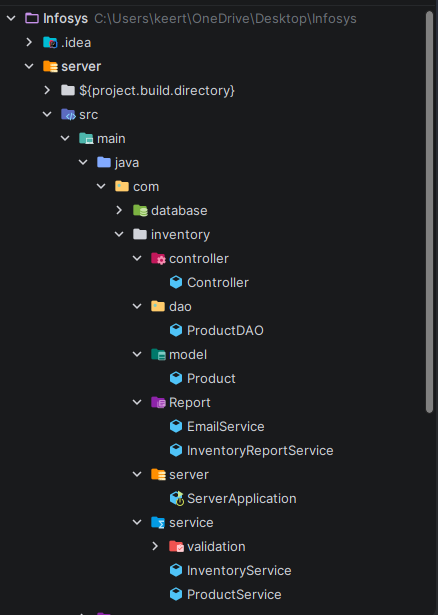

# 📦 Inventory Monitoring & Reporting System — Business Layer

> A **Spring Boot** REST API that manages inventory, performs CRUD operations on products, and automatically sends **low-stock email alerts** via Gmail SMTP.  
> Built as part of the **Infosys Springboard Virtual Internship 6.0**.

---

## 🚀 Features

- ✅ Add, view, update, and delete products via REST API
- ✅ Reduce or increase stock levels
- ✅ Auto-detects low-stock products after every stock reduction
- ✅ Sends a formatted email alert when stock drops below minimum quantity
- ✅ Clean layered architecture: Controller → Service → DAO → Database

---

## 🛠️ Tech Stack

| Layer | Technology |
|---|---|
| Language | Java 17+ |
| Framework | Spring Boot |
| Database | MySQL |
| Email | JavaMail (Gmail SMTP) |
| API Testing | Postman |
| IDE | IntelliJ IDEA |

---

## 🗂️ Project Structure
```

IM-Business-Layer/
├── server/
│   └── src/
│       └── main/
│           ├── java/com/
│           │   ├── controller/
│           │   │   └── Controller.java              # REST endpoints, delegates to services
│           │   ├── dao/
│           │   │   └── (Data Access Objects)        # DB query logic
│           │   ├── model/
│           │   │   └── (Entity classes)             # Product model / POJOs
│           │   ├── report/
│           │   │   ├── EmailService.java            # Gmail SMTP configuration & sender
│           │   │   └── InventoryReportService.java  # Low-stock checker, triggers email
│           │   ├── server/
│           │   │   └── ServerApplication.java       # Spring Boot entry point
│           │   └── service/
│           │       ├── InventoryService.java        # Stock update logic
│           │       └── ProductService.java          # Product CRUD logic
│           └── resources/
│               ├── application.properties           # DB + email config (keep private)
│               └── stockmanagement.sql              # Database dump for quick setup
├── img.png
├── img_1.png
├── img_2.png
├── LICENSE
└── README.md
```
---

## ⚙️ Setup Guide

### Prerequisites

- Java 17+
- MySQL 8+
- IntelliJ IDEA
- Postman (for API testing)
- A Gmail account with App Password

---

### 1. Database Setup

1. Open **MySQL Workbench** (or any SQL client)
2. Open and run `stockmanagement.sql` from the `resources/` folder
3. This creates the `stockmanagement` database with all required tables and sample data

---

### 2. Email Setup

1. Use a personal Gmail account as the **sender**
2. Enable **2-Step Verification** on that Gmail account
3. Go to [myaccount.google.com](https://myaccount.google.com) → search **App Passwords** → generate a 16-character app password
4. Open `EmailService.java` and update the credentials:

```java
private final String username = "yourpersonal@gmail.com";
private final String password = "your-16-char-app-password";
```

5. Open `InventoryReportService.java` and set your **receiver email**

> ⚠️ **Security tip:** Avoid hardcoding credentials in source files for production use. Move them to `application.properties` and add that file to `.gitignore`.

---

### 3. Run the Application

1. Complete Database and Email setup above
2. Open the project in **IntelliJ IDEA**
3. Run `ServerApplication.java`
4. The app starts on `http://localhost:8080`
5. Check the console — low-stock products will be listed on startup
6. Check your inbox — an alert email arrives automatically when stock is low

---

## 📡 API Reference

Base URL: `http://localhost:8080`

### Products

| Method | Endpoint | Description |
|---|---|---|
| `POST` | `/api/product` | Add a new product |
| `GET` | `/api/products` | Get all products |
| `GET` | `/api/product/{id}` | Get a product by ID |
| `DELETE` | `/api/product/{id}` | Delete a product |

### Stock Management

| Method | Endpoint | Description |
|---|---|---|
| `POST` | `/api/reduce/{id}/{quantity}` | Reduce stock (triggers low-stock check & alert) |
| `POST` | `/api/increase/{id}/{quantity}` | Increase stock |

---

## 🧪 Testing with Postman

[Download Postman](https://www.postman.com/downloads/) → Sign up → Create a workspace.

### 1. Add a New Product
- **Method:** `POST`  
- **URL:** `http://localhost:8080/api/product`  
- **Body → raw → JSON:**
```json
{
  "name": "Product Name",
  "price": 99.99,
  "stock": 50,
  "category": "Electronics"
}
```
- **Expected:** `Product added`

### 2. Get All Products
- **Method:** `GET`  
- **URL:** `http://localhost:8080/api/products`  
- **Expected:** JSON array of all products

### 3. Get Product by ID
- **Method:** `GET`  
- **URL:** `http://localhost:8080/api/product/{product_id}`  
- **Expected:** Single product object

### 4. Reduce Stock *(triggers email alert if stock falls below minimum)*
- **Method:** `POST`  
- **URL:** `http://localhost:8080/api/reduce/{product_id}/{quantity}`  
- **Expected:** Stock reduced; low-stock email sent if applicable

### 5. Increase Stock
- **Method:** `POST`  
- **URL:** `http://localhost:8080/api/increase/{product_id}/{quantity}`  
- **Expected:** Stock increased

### 6. Delete a Product
- **Method:** `DELETE`  
- **URL:** `http://localhost:8080/api/product/{product_id}`  
- **Expected:** Product deleted

---

## 📬 How the Email Alert Works

```
POST /api/reduce/{id}/{quantity}
        ↓
InventoryService reduces stock in DB
        ↓
InventoryReportService scans all products
        ↓
If any product's stock < minimum quantity
        ↓
EmailService sends alert via Gmail SMTP
        ↓
Receiver gets email with low-stock product details
```

The alert email contains:
- **Sender:** configured Gmail account
- **Receiver:** configured alert receiver
- **Subject:** Low stock alert
- **Body:** List of products with stock below minimum threshold

---

## 📸 Screenshots

| Console Output | Email Alert |
|---|---|
|  |  |

---

## 👤 Authors

**Dushyant , Bhargav, Sneha, Asifa**   
Java Developer Intern — Infosys Springboard Virtual Internship 6.0

---

## 📄 License

This project is licensed under the [MIT License](LICENSE).
